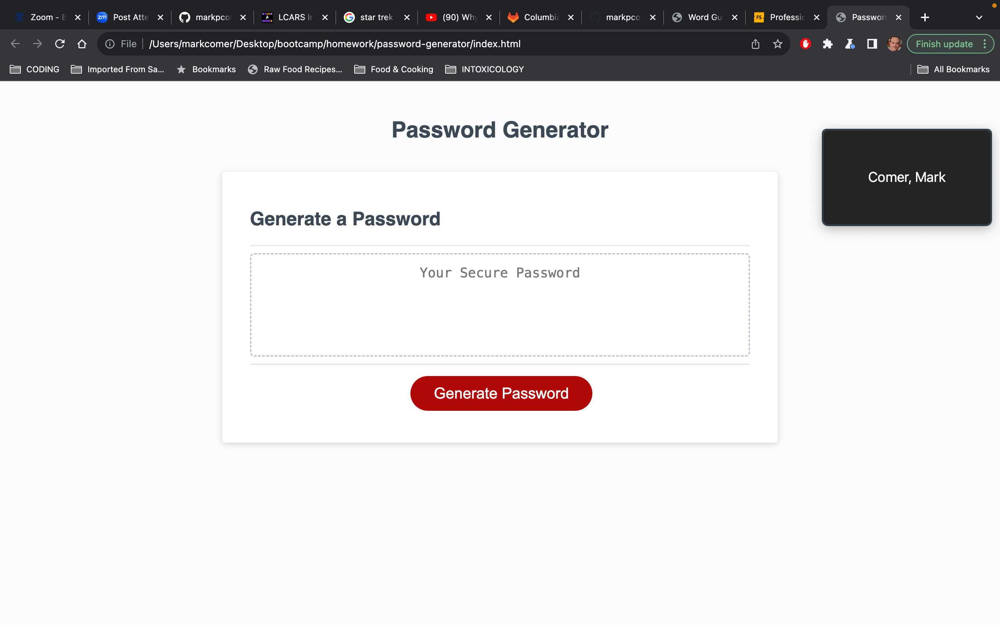

# Password Generator 

## Table of Contents

* [Description](#description)
* [Installation](#installation)
* [Usage](#usage)
* [Deployed-Link](#deployed-link)
* [Contributing](#contributing)
* [Questions](#questions)
* [License](#license)

## Description

This web app generates random passwords based on user-selected criteria. Users can customize the password’s length and choose to include uppercase letters, lowercase letters, numbers, and special characters. The app has a clean, responsive interface that adapts to any screen size. After selecting the options, the generated password is shown in both an alert window and a text field, providing a simple and secure solution for password creation.

